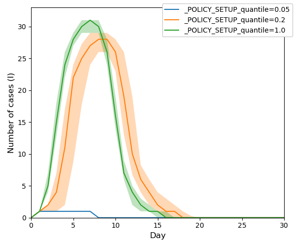

#  MAIS &nbsp; &nbsp; <a href="https://doi.org/10.5281/zenodo.16421566"></a>
## Multi-Agent Information/Infection Spread Model 


<!--- PDF BREAK -->

The MAIS Model is a collection of agent based network models for simulation of information or infection spread. 
You can use your own network (graph) or play with demo graphs included in this repository. You can derive your own models with customised set of agent states or encode customised policy modules.   

For information spread use:
  + [InfoSIRModel](src/models/agent_info_models.py)
    - the implementation of SIR model
    - parameters:
      - `beta`: transmision strenght
      - `I_duration`: duration in state I in days
    - policy functions:
      - [`Spreader`](src/policies/info_spreader.py): seeds the source of information to the node with pagerank corresponding to given quantile             
  + [InfoTippingModel](src/models/agent_info_models.py)
    - the implementation of Tipping model
    - parameters:
        - `theta`: the threshold
          
 For infection spread use:
   + [SimulationDrivenModel](src/models/agent_based_network_model.py)
      - See the [model documentation](doc/model.md) for technical details.


## Examples of Simulation Results

Please follow the links to find out more details about the examples presented.
+ InfoSIRModel <br>
  ```console
  cd scripts
  source verona_sir.sh
  ```
  Simple examples of information spread modelling using SIR model `InfoSIRModel`.<br>
  
  
  ```console
  cd scripts
  source verona_spreader.sh
  ```
  Simple examples of information spread modelling using SIR model `InfoSIRModel` with different spreader policies.<br>
  
  
  
+ TippingModel <br>
  ```console
  cd scripts
  source verona_tipping.sh
  ```
  Simple examples of information spread modelling using Tipping model `InfoTippingModel`.<br>
  
  
+ [Demo](doc/demo.md) <br>
  Simple examples of infection transmission model using `SimulationDrivenModel`.<br>
  

+ [Experiment1](doc/experiment1.md) and [Experiment2](doc/experiment2.md) <br>
 More sophisticated examples of experiments with `SimulationDrivenModel`. <br>
 <table>
<tr>
  <td></td>
  <td></td>
  </tr>
  <tr> 
    <td> Infected individuals </td>
    <td> Detected individuals </td>
  </tr>
</table>  

<table>
<tr>
  <td></td>
  <td> </td>
  </tr> 
  <tr> 
    <td>Infected individuals (active cases)</td>
    <td>Detected individuals (active cases)</td>
  </tr>
</table> 

# Installation

All the requirements can be installed using [conda](https://docs.conda.io/en/latest/) (plus some packages using pip):

```console
conda create -n mais python=3.12 -y
conda activate mais
conda install --file requirements_conda.txt -y
pip install -r requirements.txt 
```
**Optional:** If you want to create an animation from your simulation (script [animate.py](scripts/animate.py)) or you want to use `Spreader policy` function for information spread seeding, install `graph-tool`: 
```console
conda install -c conda-forge graph-tool
```
**Troubleshooting:** Graph-tool often takes extreme amount of time to install. In such case, it helps to first install `graph-tool` into the clean new environment, and second install the rest of  packages.

<!--For other options and/or more help please refer to the [installation instructions](doc/installation.md).-->

# Usage

All the executable scripts are located in the [scripts](scripts) subfolder. So first of all run:

```console
cd scripts
```

Most of the following commands take as a parameter the name of an INI file. The INI file describes all the configuration
settings and locations of other files used. Please refer to [INI file specification](doc/inifile.md) for details.

**Tip**: Instead of a single value in INI file, use a semicolon (;) separated list of values. 
Such INI file will be expanded to the set of configs, each config will be processed separately.

There are several INIs provided so that you can base your experiments on these settings:

|filename|description|
|---|---|
|[verona_sir.ini](config/verona_sir.ini)| Information spread using SIR model on a toy graph *Verona*.|
|[verona_tipping.ini](config/verona_tipping.ini)| Information spread using Tipping model on a toy graph *Verona*.|
|[demo.ini](config/demo.ini)| Infection spread on a graph of a small region (5k inhabitants) for demonstration purposes.|


### 1. Running your experiments

Run your experiment. Note that the first time you run it, the graph is loaded from CSV files, which may take time for bigger graphs.

+ If you wish to run one simulation only, use `run_experiment.py`:

```console
python run_experiment.py -r ../config/verona_sir.ini my_experiment
```
After the run finishes, you should find the output CSV files  in the directory specified as `output_dir`
in your [INI file](doc/inifile.md#task). The INI files provided use `data/output/model` directory.
The filenames begin with the prefix `history_my_experiment`. 

+ For a proper experiment, you should evaluate the model more times. You can do it in parallel using:

```console
python run_multi_experiment.py -R ../config/random_seeds.txt --n_repeat=100 --n_jobs=4 ../config/verona_sir.ini my_experiment
```

By default it produces a ZIP file with the resulting history files. You can change `output_type` to FEATHER and the result
will be stored as one data frame in the feather format. The resulting file is stored in the directory specified
by `output_dir` and its name has a prefix `history_my_experiment`.

### 3. Result visualisation

Now you can create a plot from the resulting files and save it to the path specified by `--out_file PATH_TO_IMG`.

```console
python plot_experiments.py ../data/output/model/history_my_experiment_*.zip --out_file ./example_img.png
```
### 4. Animation 

 If you want to run animation, you need to have a file with node states from a simulation run. This file is generated if you use 

```
save_node_states = Yes
```
in your config file. Such a config file is for example [verona_ani.ini](config/verona_ani.ini). 

First you run a simulation with such config file
```console
python run_experiment.py -r ../config/verona_ani.ini animation
```
Then you can run the animation:
```console
python animate.py ../config/verona_ani.ini --nodes_file ../data/output/model/node_states_animation.csv
```


<!--- PDF BREAK --><!--- PDF BREAK -->

## Configuration and Advanced Features

Please consult [How to run simulations](doc/run.md) for options of individual scripts,
[INI file specification](doc/inifile.md), and [How to fit the paremeters](doc/run.md#6-fitting-your-model).

# 🧠 NetRate Inference Module for MAIS

This module extends **MAIS** with the **NetRate algorithm**, allowing you to *reconstruct infection networks* (i.e., infer “who infected whom”) from simulated infection cascades.

---

## ⚙️ Why a Separate Environment?

The NetRate module uses advanced **convex optimization libraries** (`cvxpy`, `mkl-service`) that depend on math backends different from those used in MAIS.

Creating a **dedicated conda environment** for NetRate ensures:

- 🧩 No version conflicts between simulation (MAIS) and optimization (NetRate)
- ⚡ Faster installation and cleaner dependency management
- 🧼 Easier troubleshooting and reproducibility

---

## 🧮 Environment Setup

To keep the MAIS simulator and the NetRate optimizer independent, you can choose one of the following setups.

### 🪄 **Option A — Create a clean NetRate environment (recommended)**

This ensures full isolation and avoids dependency conflicts with MAIS (especially around `cvxpy`, `mkl`, and `numpy` versions).

```bash
conda create -n netrate python=3.12 -y
conda activate netrate
conda install --scripts/file requirements_netrate.txt -y
```

This installs the minimal dependencies needed for inference:
```
numpy
pandas
scipy
cvxpy
matplotlib
networkx
mkl-service
```

You can verify your setup with:
```bash
python scripts/netrate/check_env.py
```

Expected output:
```
Python: 3.12.x
NumPy: 2.x.x
Pandas: 2.x.x
SciPy: 1.x.x
CVXPY: 1.x.x
OK: all libs import.
```

---

### 🧩 **Option B — Use the same environment as MAIS**

If you prefer simplicity (one unified setup for all scripts),  
you can install NetRate’s dependencies directly into your existing `mais` environment:

```bash
conda activate mais
conda install --scripts/file requirements_netrate.txt -y
```

✅ This is convenient for quick testing,  
⚠️ but it can occasionally lead to library conflicts if you upgrade packages later.

---

## 🔁 NetRate Workflow

| Step | Script | Description | Output |
|------|---------|-------------|---------|
| 1️⃣ | `run_experiment_netrate.py` | Run MAIS simulation with per-agent infection logs | `history_netrate_*.zip` |
| 2️⃣ | `extract_netrate_cascades.py` | Convert MAIS ZIPs into cascades | `netrate_cascades_all.csv` |
| 3️⃣ | `netrate_infer.py` | Infer transmission rates via convex optimization | `netrate_result.csv` |
| 4️⃣ | `compare_inferred_to_verona.py` | Compare inferred edges vs. Verona graph | Precision & Recall summary |
| 5️⃣ | `visualize_netrate_vs_true.py` | Visualize true vs inferred networks | PNG plot |

---
### 🧩 Ensure Python Recognizes Packages
Before running NetRate scripts, make sure both `scripts/` and `scripts/netrate/` contain an `__init__.py` file. This ensures Python treats them as packages.

If they don’t exist yet, create them:

```bash
# Run from the project root (MAIS/)
# Windows PowerShell:
New-Item -ItemType File -Force .\scripts\__init__.py
New-Item -ItemType File -Force .\scripts\netrate\__init__.py

# Linux / macOS:
touch scripts/__init__.py
touch scripts/netrate/__init__.py
```

## 🚀 Example Usage

### Run inference
```bash
python scripts/netrate/netrate_infer.py `
  --cascades data/output/model/netrate/netrate_cascades_all.csv `
  --out data/output/model/netrate_result.csv
```

### Compare with ground truth
```bash
python scripts/netrate/compare_inferred_to_verona.py
```

### Visualize the inferred vs. true network
```bash
python scripts/netrate/visualize_netrate_vs_true.py
```

---

## 📈 Example Output

```
True undirected edges: 224
Top-K predicted (K=true edges): 224
TP overlap: 177
Precision@K: 0.790  Recall@K: 0.790
```

✅ **Interpretation:**  
> NetRate successfully recovered ~79% of the true edges among the top 224 inferred links.

---

## 🧩 Files Overview

```
scripts/netrate/
│
├── netrate_infer.py                 # Main inference script
├── extract_netrate_cascades.py      # Converts MAIS histories to cascades
├── run_experiment_netrate.py        # Runs MAIS simulations for NetRate
├── compare_inferred_to_verona.py    # Compares inferred edges to Verona graph
├── visualize_netrate_vs_true.py     # Plots inferred vs true networks
├── peek_results.py                  # Preview inferred β values
├── utils_netrate.py                 # Helper functions
├── check_env.py                     # Environment verification
├── requirements_netrate.txt         # Minimal NetRate dependencies
└── __init__.py
```

---

## 📚 References

Gomez-Rodriguez, M., Leskovec, J., & Krause, A. (2011).  
*Inferring Networks of Diffusion and Influence.*  
KDD ’10: Proceedings of the 16th ACM SIGKDD International Conference on Knowledge Discovery and Data Mining.

---

© 2025 — NetRate Integration for MAIS  
Developed as an extension for network diffusion inference and analysis.