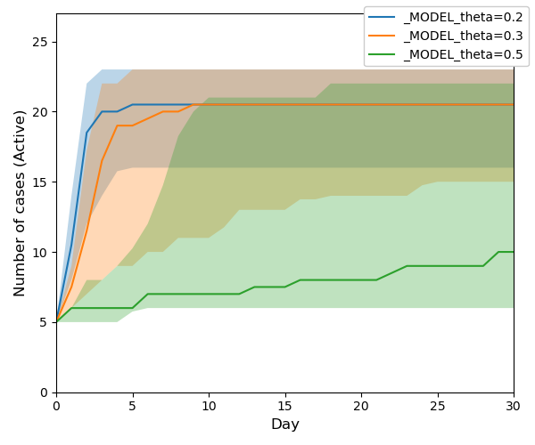

#  MAIS
## Multi-Agent Information/Infection Spread Model 


<!--- PDF BREAK -->

The MAIS Model is a collection of agent based network models for simulation of information or infection spread. 
You can use your own network (graph) or play with demo graphs included in this repository. You can derive your own models with customised set of agent states or encode customised policy modules.   

For information spread use:
  + [InfoSIRModel](src/models/agent_info_models.py)
    - the implementation of SIR model
    - parameters:
      - `beta`: transmision strenght
      - `I_duration`: duration in state I in days
    - policy functions:
      - [`Spreader`](src/policies/spreader_policy.py): seeds the source of information to the node with pagerank corresponding to given quantile             
  + [InfoTippingModel](src/models/agent_info_models.py)
    - the implementation of Tipping model
    - parameters:
        - `theta`: the threshold
          
 For infection spread use:
   + [SimulationDrivenModel](src/models/agent_based_network_model.py)
      - See the [model documentation](doc/model.md) for technical details.


## Examples of Simulation Results

Please follow the links to find out more details about the examples presented.
+ [InfoSIRModel](doc/sir.md) <br>
  Simple examples of information spread modelling using SIR model `InfoSIRModel`.<br>
  
+ [TippingModel](doc/tipping.md) <br>
  Simple examples of information spread modelling using Tipping model `InfoTippingModel`.<br>
  
+ [Demo](doc/demo.md) <br>
  Simple examples of infection transmission model using `SimulationDrivenModel`.<br>
  


# Installation

All the requirements can be installed using [conda](https://docs.conda.io/en/latest/):

```console
conda create -n mais python=3.12 -y
conda activate mais
conda install --file requirements_conda.txt -y
python -m pip install -r requirements.txt
```
If you want to create an animation from your simulation (script [animate.py](scripts/animate.py)) or you want to use `Spreader policy` function for information spread seeding, install `graph-tool`: 
```console
conda install -c conda-forge graph-tool
```
<!--For other options and/or more help please refer to the [installation instructions](doc/installation.md).-->

# Usage

All the executable scripts are located in the [scripts](scripts) subfolder. So first of all run:

```console
cd scripts
```

Most of the following commands take as a parameter the name of an INI file. The INI file describes all the configuration
settings and locations of other files used. Please refer to [INI file specification](doc/inifile.md) for details.

There are several INIs provided so that you can base your experiments on these settings:

|filename|description|
|---|---|
|[verona_sir.ini](config/verona_sir.ini)| Information spread using SIR model on a toy graph *Verona*.|
|[verona_tipping.ini](config/verona_tipping.ini)| Information spread using Tipping model on a toy graph *Verona*.|
|[demo.ini](config/demo.ini)| Infection spread on a graph of a small region (5k inhabitants) for demonstration purposes.|


### 1. Running your experiments

Run your experiment. Note that the first time you run it, the graph is loaded from CSV files, which may take time for bigger graphs.

+ If you wish to run one simulation only, use `run_experiment.py`:

```console
python run_experiment.py -r ../config/verona_sir.ini my_experiment
```
After the run finishes, you should find the output CSV files  in the directory specified as `output_dir`
in your [INI file](doc/inifile.md#task). The INI files provided use `data/output/model` directory.
The filenames begin with the prefix `history_my_experiment`. 

+ For a proper experiment, you should evaluate the model more times. You can do it in parallel using:

```console
python run_multi_experiment.py -R ../config/random_seeds.txt --n_repeat=100 --n_jobs=4 ../config/verona_sir.ini my_experiment
```

By default it produces a ZIP file with the resulting history files. You can change `output_type` to FEATHER and the result
will be stored as one data frame in the feather format. The resulting file is stored in the directory specified
by `output_dir` and its name has a prefix `history_my_experiment`.

### 3. Result visualisation

Now you can create a plot from the resulting files and save it to the path specified by `--out_file PATH_TO_IMG`.

```console
python plot_experiments.py ../data/output/model/history_my_experiment_*.zip --out_file ./example_img.png
```
### 4. Animation 
 TODO

<!--- PDF BREAK --><!--- PDF BREAK -->

## Configuration and Advanced Features

Please consult [How to run simulations](doc/run.md) for options of individual scripts,
[INI file specification](doc/inifile.md), and [How to fit the paremeters](doc/run.md#6-fitting-your-model).

